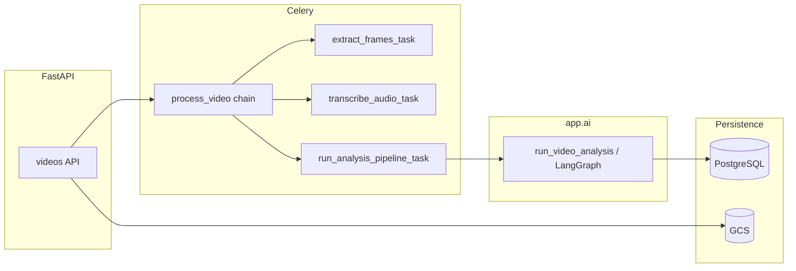
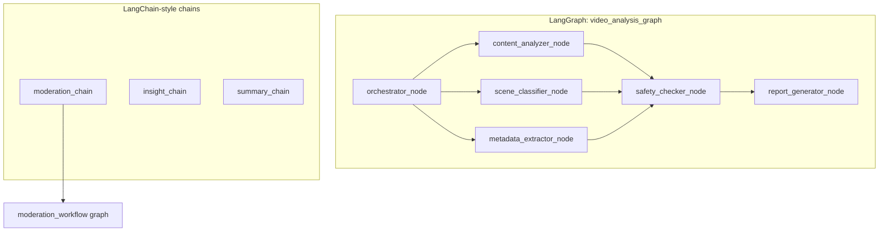

# VidShield AI — Technical Interview Board Briefing

This document helps you **walk a technical panel through the repository**: architecture, layering, and especially **AI / LangGraph / LangChain** behavior. It complements `docs/PRD.md`, `docs/ARCHITECTURE.md`, `docs/API_SPEC.md`, and `docs/DB_SCHEMA.md`.

---

## 1. How to structure your presentation (recommended flow)

1. **Product one-liner (30 seconds)**  
   VidShield AI ingests recorded and live video on GCP, runs vision + audio + policy-aware moderation, persists structured results, and surfaces them in a Next.js dashboard and partner APIs.

2. **Runtime topology (1–2 minutes)**  
   - **FastAPI** (`backend/app/main.py`) — REST + WebSocket/Socket.IO; thin routes, heavy work offloaded.  
   - **Celery workers** (`backend/app/workers/`) — frame extraction, Whisper transcription, LangGraph pipeline, live chunk moderation, webhooks, notifications.  
   - **PostgreSQL** — canonical state (videos, moderation results, policies, audit).  
   - **Redis** — broker, caching, rate limits, live event pub/sub.  
   - **GCS** — object storage for video keys (legacy field name `s3_key` still used in code/DB for compatibility).

3. **Deep dive: AI pipeline (5–10 minutes)** — use Section 3–5 below; this is where most technical depth lives.

4. **APIs and contracts (2 minutes)**  
   Point to `docs/API_SPEC.md` and the error envelope pattern; mention RBAC and API keys for different clients (admin vs dashboard vs partners).

5. **Ops / quality (1 minute)**  
   Tests under `backend/tests/test_ai/`, `terraform/`, GitHub Actions, `docs/DEPLOYMENT.md` / `docs/GCP_DEPLOYMENT_RUNBOOK.md`.

**Interview tip:** Lead with **data flow** (video → worker → graph → DB → UI), then open **one file per layer** (`video_analysis_graph.py`, then one agent) to show code quality and boundaries.

---

## 2. Repository hierarchy (top level)

| Path | Role |
|------|------|
| `backend/` | FastAPI app, SQLAlchemy models, services, **AI package** (`app/ai`), Celery workers, Alembic migrations, pytest. |
| `frontend/` | Next.js App Router, dashboard/moderation/live UI, BFF-style `src/app/api/**` routes that proxy to the backend. |
| `docs/` | PRD, architecture, API, DB schema, GCP runbooks, **this briefing**. |
| `terraform/` | GCP infrastructure (VPC, GKE, Cloud SQL, GCS, etc.). |
| `.github/workflows/` | CI/CD. |
| `docker-compose*.yml`, `Makefile` | Local orchestration and developer commands. |

**Clean architecture mantra for the board:** HTTP layer → **services** (business rules) → **repositories/ORM**; **AI** is a specialized subsystem invoked from workers (and occasionally services), not from routes directly for long-running work.

---

## 3. End-to-end workflows (what happens when…)

### 3.1 Recorded video — full analysis

1. Client uploads or registers a video; object lands in **GCS**; DB row stores metadata (see `Video` model).  
2. **Celery** `video_tasks.process_video` orchestrates: **frame extraction** (`extract_frames` / OpenCV), **transcription** (`transcribe_audio` / Whisper), thumbnail generation, then **`run_analysis_pipeline_task`**.  
3. `run_analysis_pipeline_task` calls **`run_video_analysis`** in `app/ai/graphs/video_analysis_graph.py`, which runs the **LangGraph** pipeline and returns a **`ModerationReport`**.  
4. Results are written to **`ModerationResult`**, video status set to **READY**, analytics events recorded, moderation queue / notifications enqueued.

### 3.2 Fast re-moderation (policy change, segments, no full vision re-run)

- **`run_moderation_workflow`** (`app/ai/graphs/moderation_workflow.py`) — smaller LangGraph: load context → **`run_moderation_chain`** → confidence check → escalate or finalize.  
- Invoked from **`moderation_tasks.run_moderation_task`** via `asyncio.run(...)`.

### 3.3 Live stream chunk

1. Frames (base64) sent for a `stream_id`.  
2. **`stream_tasks.moderate_live_chunk_task`** loads `LiveStream`, checks `moderation_active`.  
3. Runs **`LiveStreamModerator.analyze_chunk`** — parallel vision moderation, OCR, face analysis.  
4. Violations → **`Alert`** rows; JSON published to Redis channel for WebSocket clients.

---

## 4. AI subsystem — mental model

- **Graphs** = multi-step **state machine** (LangGraph) with explicit edges and merge semantics.  
- **Agents** = classes extending **`BaseAgent`**: `async def run(state) -> partial_state_update`.  
- **Chains** = single-shot **LLM calls** with structured JSON outputs (LangChain `ChatOpenAI` + messages).  
- **Tools** = deterministic or semi-deterministic **utilities** (FFmpeg, OpenCV, Whisper wrapper, Pinecone, OCR, face heuristics).  
- **Schemas** (`app/ai/schemas.py`) = **Pydantic contracts** for decisions, violations, reports.  
- **Prompts** (`app/ai/prompts/*.py`) = **system/user strings** kept out of orchestration logic.

---

## 5. Directory and file reference — `backend/app/ai/`

### 5.1 Root of `app/ai/`

| File | Purpose |
|------|---------|
| `__init__.py` | Package marker; may export public AI surface. |
| `base.py` | **`BaseAgent`**: lazy `AsyncOpenAI` client from settings, **`_call_with_retry`**, JSON fence stripping (**`_extract_json`**), **`_mark_completed`** / **`_append_error`** helpers for LangGraph reducers. |
| `state.py` | **`VideoAnalysisState`** `TypedDict`: inputs (`video_id`, `trace_id`, `video_url`, `policy_rules`), frames/transcript, per-agent outputs, **`errors`** and **`completed_agents`** with **`operator.add`** reducers for parallel nodes. |
| `schemas.py` | **Enums**: `ViolationSeverity`, `ModerationDecision`, `SceneCategory`, `GarmCategory`, `BrandSuitabilityTier`. **Models**: `Violation`, `ViolationSource`, `ContentAnalysisResult`, `SafetyResult`, `MetadataResult`, `SceneClassification`, `ModerationReport`, etc. Validates and coerces LLM output before persistence. |
| `pipeline_agent_audit.py` | **`record_pipeline_audit_sync`**, **`run_audited_pipeline_step`**: wraps each graph node to write **agent audit** rows (sync DB for Celery/async compatibility), timing, success/failure. |

### 5.2 `app/ai/graphs/`

| File | Main symbols | Behavior |
|------|----------------|----------|
| `video_analysis_graph.py` | **`run_video_analysis`**, `_build_graph`, `*_node` wrappers | Builds a **StateGraph(VideoAnalysisState)**. **Singleton agent instances**. Nodes wrapped with **`run_audited_pipeline_step`**. **Fan-out** after orchestrator to content analyzer, scene classifier, metadata extractor; **fan-in** to safety checker; then report generator → **END**. Compiles graph once (`_compiled_graph`). |
| `moderation_workflow.py` | **`run_moderation_workflow`**, `_build_workflow` | Lighter graph: **load_context** → **run_moderation** (calls **`run_moderation_chain`**) → **evaluate_confidence** → conditional **escalate** vs **finalize** → END. Returns **`ModerationWorkflowResult`**. |
| `__init__.py` | Exports | Public graph imports. |

**Node wrapper pattern:** Each `*_node` async function calls `run_audited_pipeline_step` with a `runner` lambda that invokes `agent.run(dict(state))` and a `summarize` callback for short audit text.

### 5.3 `app/ai/agents/`

| File | Agent `name` | `run()` responsibility | Notable helpers |
|------|----------------|-------------------------|-----------------|
| `orchestrator.py` | `orchestrator` | Ensures **frames** (FFmpeg MJPEG pipe or placeholders) and **transcript** (Whisper on downloaded bytes for HTTP URLs). Initializes error/completed lists. | `_sample_frames`, `_split_mjpeg`, `_placeholder_frames`, `_transcribe` |
| `content_analyzer.py` | `content_analyzer` | Up to 8 frames + transcript → **GPT-4o vision** → **`ContentAnalysisResult`** JSON. | `_analyze` |
| `scene_classifier.py` | `scene_classifier` | Each frame → vision call; batches of **`_MAX_CONCURRENT`** with `asyncio.gather`; builds **`SceneClassification`** list. | `_classify_batch`, `_classify_frame` |
| `metadata_extractor.py` | `metadata_extractor` | First frame + transcript → **GPT-4o** → **`MetadataResult`** (entities, brands, OCR list, objects, locations). | `_extract` |
| `safety_checker.py` | `safety_checker` | **`_check_hard_stops`** (e.g. high-confidence nudity/self-harm, zero-tolerance rules) may **short-circuit** to `REJECTED`. Else LLM with **`response_format=json_object`** → **`SafetyResult`** (violations, decision, confidence). | `_build_scene_summary`, `_check` |
| `report_generator.py` | `report_generator` | Aggregates prior outputs; **gpt-4o-mini** synthesizes JSON aligned with **`ModerationReport`**; violations taken from safety result; **`_fallback_report`** on failure. | `_generate`, `_fallback_report` |
| `live_stream_moderator.py` | (class `LiveStreamModerator`) | **`analyze_chunk`**: parallel **vision moderation**, **`run_ocr`**, **`analyze_faces`**; returns structured chunk result for alerts. | Async gather of subtasks |

### 5.4 `app/ai/chains/`

| File | Entry function | Model | Role |
|------|----------------|-------|------|
| `moderation_chain.py` | **`run_moderation_chain`** | `gpt-4o` | Builds system + user messages from summary, violations, rules, scene counts, transcript excerpt; parses JSON into **`ModerationChainOutput`**. On parse/API failure → **`NEEDS_REVIEW`**, never silent approve. |
| `insight_chain.py` | **`run_insight_chain`** | `gpt-4o` | Operator-facing **insights**: themes, risk signals, audience suitability. |
| `summary_chain.py` | **`run_summary_chain`** | `gpt-4o-mini` | Executive summary + key moments + content rating; prompts imported from **`prompts/summary_prompts.py`**. |

### 5.5 `app/ai/tools/`

| File | Primary API | Technology / notes |
|------|-------------|---------------------|
| `frame_extractor.py` | **`extract_frames`**, **`FrameExtractionResult`** | OpenCV; **GCS download to temp** for `gs://` URLs; base64 JPEGs + timestamps. |
| `audio_transcriber.py` | **`transcribe_audio`** | FFmpeg extract audio → **Whisper** (`AsyncOpenAI`). |
| `ocr_tool.py` | **`run_ocr`** | Text extraction from frames (implementation supports moderation / live paths). |
| `object_detector.py` | **`detect_objects`** | Object labels for metadata / safety context. |
| `face_analyzer.py` | **`analyze_faces`**, **`FaceAnalysisResult`** | Used by **live** moderator for face-related signals. |
| `similarity_search.py` | **`query_similar`**, **`upsert_vectors`** | **Pinecone**-backed embedding search; lazy index init; test injection hook **`_index`**. |
| `__init__.py` | Re-exports | Central import surface for tools. |

### 5.6 `app/ai/prompts/`

| File | Consumers | Content |
|------|-----------|---------|
| `analysis_prompts.py` | Content analyzer, metadata extractor | JSON-shaped instructions for summaries and metadata fields. |
| `moderation_prompts.py` | Safety checker, scene classifier | Safety evaluation and per-frame classification instructions. |
| `summary_prompts.py` | Summary chain, report generator | Executive summary and final report synthesis templates (`SUMMARY_*`, `REPORT_*`). |

---

## 6. Workers touching AI (where graphs are invoked)

| File | Task / function | AI entry point |
|------|-----------------|----------------|
| `workers/video_tasks.py` | **`run_analysis_pipeline_task`** | **`run_video_analysis`** → full LangGraph pipeline; persists **`ModerationResult`**, analytics, notifications. |
| `workers/video_tasks.py` | **`process_video`** (orchestrated chain in file) | Schedules extract / transcribe / **`run_analysis_pipeline_task`**. |
| `workers/moderation_tasks.py` | **`run_moderation_task`** | **`run_moderation_workflow`** for fast path / re-run. |
| `workers/stream_tasks.py` | **`moderate_live_chunk_task`** | **`LiveStreamModerator.analyze_chunk`**. |

**Pattern:** Celery tasks are **synchronous**; they use **`asyncio.run(...)`** to await async AI code.

---

## 7. Backend outside AI (concise map for “where is X?”)

### 7.1 `app/api/v1/`

Routers are wired in **`router.py`**: `auth`, `users`, `videos`, `moderation`, `analytics`, `live`, `policies`, `webhooks`, `api_keys`, `agent_audit`, `reports`, `notifications`, billing/support, etc. Each file defines FastAPI routes; keep them **thin** — delegate to services.

### 7.2 `app/services/`

Business logic: **`video_service`**, **`moderation_service`**, **`stream_service`**, **`analytics_service`**, **`storage_service`**, **`auth_service`**, notifications, billing, PDF/report helpers, **`agent_audit_service`**, etc.

### 7.3 `app/models/` and `app/schemas/`

ORM entities vs Pydantic request/response DTOs; align with **`docs/DB_SCHEMA.md`**.

### 7.4 `app/core/`

Cross-cutting: **`security`**, **`exceptions`** + handlers, **`middleware`** (CORS, rate limit, request context), **`logging`**, **`rate_limit`**.

### 7.5 `alembic/`

Schema migrations; use **`make db-revision`** / **`make db-migrate`** per project Makefile.

---

## 8. Frontend (`frontend/src/`) — how it fits AI outcomes

| Area | Path pattern | Purpose |
|------|--------------|---------|
| App routes | `app/(app)/videos/**`, `moderation/**`, `live/**`, `dashboard/**` | Operator UX for catalog, queue, policies, streams, analytics. |
| API proxy | `app/api/**`, especially **`app/api/[...proxy]/route.ts`** | Server-side calls to FastAPI; avoids exposing keys in browser. |
| State / hooks | `stores/*`, `hooks/useVideo.ts`, `useModeration.ts` | Client state and data fetching. |
| Components | `components/video/*`, `moderation/*`, `live/*`, `analytics/*` | Visualization of **AI outputs** (badges, timelines, stream alerts). |

**Talking point:** The frontend does not run the LangGraph pipeline; it **surfaces persisted moderation results** and **live alerts** fed by workers + WebSockets/Redis.

---

## 9. Key enums and safety philosophy (soundbite for the board)

- **`ModerationDecision`**: `approved`, `rejected`, `escalated`, `needs_review`.  
- **Default-on-failure:** chains and several agents fall back to **`NEEDS_REVIEW`** or equivalent — **no silent auto-approve** on LLM/parse errors.  
- **Hard stops** in **`SafetyCheckerAgent`**: deterministic guardrails before LLM for the worst categories / zero-tolerance policies.  
- **Audit:** **`pipeline_agent_audit`** + **`agent_audit`** API — traceability per **`trace_id`** across a pipeline run.

---

## 10. Suggested live demo order (if you share screen)

1. Open **`video_analysis_graph.py`** — show graph topology in docstring + **`run_video_analysis`**.  
2. Open **`state.py`** — explain reducers for parallel writes.  
3. Open **`safety_checker.py`** — hard stops + JSON schema response.  
4. Open **`video_tasks.py`** → **`run_analysis_pipeline_task`** — bridge from worker to graph to DB.  
5. Optionally open **`live_stream_moderator.py`** + **`stream_tasks.py`** for real-time story.

---

## 11. Glossary (quick definitions)

| Term | Meaning in this repo |
|------|----------------------|
| **LangGraph** | Library building a **stateful DAG** of async nodes; **`ainvoke`** runs the full pipeline. |
| **LangChain `ChatOpenAI`** | Chat model wrapper used in **chains** for moderation/insights/summary. |
| **`ModerationReport`** | Final structured artifact from the full video graph; persisted and shown in UI. |
| **`s3_key`** | Legacy name for **GCS object key** in DB and Celery signatures. |

---

## 12. Related documentation

- **`docs/PRD.md`** — product scope and features.  
- **`docs/ARCHITECTURE.md`** — system-level design.  
- **`docs/API_SPEC.md`** — external and web API contracts.  
- **`docs/DB_SCHEMA.md`** — tables for videos, moderation, streams, alerts.  
- **`docs/GCP_DEPLOYMENT_RUNBOOK.md`** — operations on GCP.

---

*Generated for interview preparation; aligns with the codebase layout as of the documentation date. When the code and docs diverge, treat source files as authoritative.*
