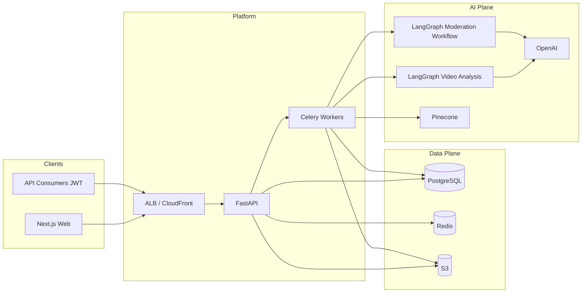

# VidShield AI — Presentation & Study Guide

**Audience:** You, presenting to a large technical or mixed audience  
**Purpose:** Learn, memorize, and deliver a clear story from problem → architecture → AI → workflows → business value  
**Aligned with:** `docs/PRD.md`, `docs/ARCHITECTURE.md`, `docs/AWS-ARCHITECTURE-DESIGN.md`, and the implemented codebase  

---

## How to use this document (before you speak)

1. **Read once for map:** Sections 1–3 (10 minutes).  
2. **Memorize the spine:** Section 8 (“One slide in your head”) + the pipeline rhyme **“One opening, three lenses, one verdict, one report”** (Orchestrator → **C**ontent + **S**cene + **M**etadata in parallel → **S**afety → **R**eport).  
3. **Own the demo story:** Section 9 (upload → worker → graph → queue).  
4. **ROI without fantasy:** Section 12 uses *categories of value* and *example KPIs you can measure*—avoid claiming dollar returns unless you have your org’s data.  

**Download bundle (same folder):**

| File | Use |
|------|-----|
| `docs/VidShield-AI-Presentation-Study-Guide.md` | Deep reference + diagrams + ROI framing |
| `docs/VidShield-AI-Presentation-Speaker-Notes.md` | Slide-by-slide bullets + what to say |
| `docs/VidShield-AI-Presentation-Bundle.docx` | Word export (generated if Pandoc is installed; see below) |
| `docs/VidShield-AI-QA-Interview-Prep.md` | Q&A bank + embedded `architecture_images` for talks & interviews |

**PDF / Word:** Open any `.md` in VS Code and export to PDF, or run `pandoc` (commands in `docs/BUILD-PRESENTATION-DOCS.md`). If `VidShield-AI-Presentation-Bundle.docx` is not in the repo, generate it locally with Pandoc.

---

## 1. Elevator pitch (15–20 seconds)

> **VidShield AI** is an enterprise-style platform for **AI-assisted video intelligence and content moderation**. Operators upload or register video (or monitor **live streams**); the system extracts frames and transcripts, runs a **LangGraph multi-agent pipeline** with policy rules, stores structured moderation outcomes, and surfaces **queues, analytics, webhooks, billing, and audit logs**—so platforms can scale trust and safety without scaling headcount linearly.

---

## 2. Problem → solution → who cares

| Stakeholder pain | What VidShield does |
|------------------|---------------------|
| Manual review does not scale | Automated first-pass moderation with optional human escalation |
| Policy varies by customer / jurisdiction | Configurable **policies** (JSON rules + default actions) |
| Need proof for compliance | **Access**, **moderation**, and **agent audit** surfaces |
| Partners need signals, not raw video | **Webhooks** and APIs for events and results |
| Ops needs visibility | **Dashboard**, **live alerts**, **analytics**, **reports (PDF)** |

---

## 3. Product scope (what you actually built)

Per **`docs/PRD.md`**, the repository implements a **full web-backed platform**, not a single script:

- **Auth & RBAC:** JWT access/refresh; roles `admin`, `operator`, `api_consumer`; password reset; access audit.  
- **Videos:** List/detail, presigned S3 upload, URL analysis, status polling, thumbnails/playback URLs when S3 is configured.  
- **Moderation:** Queue, results, human review and admin overrides.  
- **Policies:** CRUD + active toggle; rules stored as JSON.  
- **Live streams:** Lifecycle, frame ingest, alerts, WebSocket channel.  
- **Analytics, webhooks, API keys (management), reports, billing (Stripe), notifications (email/WhatsApp/in-app), support tickets.**  
- **Frontend:** Next.js 14 App Router; backend FastAPI `/api/v1`.

**Honest positioning for a senior audience:** API keys are **managed in-app** but partner **request authentication on protected routes is JWT Bearer** as implemented—say “developer keys for integration roadmap” if asked.

---

## 4. Technology stack (memorize the layers)

| Layer | Technologies (as implemented) |
|-------|--------------------------------|
| **Frontend** | Next.js 14, React 18, Tailwind, Radix UI, TanStack Query, Zustand, Socket.IO client, Axios |
| **Backend** | Python 3.12, FastAPI, Pydantic v2, SQLAlchemy 2.0, Alembic |
| **Auth** | JWT (`python-jose`), bcrypt |
| **Data** | PostgreSQL 16 (async + sync paths for workers) |
| **Async jobs** | Celery 5.4, Redis 7 broker/backend, dedicated queues (`video`, `moderation`, `analytics`, …) |
| **AI** | OpenAI SDK, LangChain 0.2.x, LangGraph 0.2.x; models configurable (`gpt-4o` / `gpt-4o-mini` defaults) |
| **Media** | FFmpeg, OpenCV, `yt-dlp` for URL ingestion |
| **Storage** | AWS S3 (boto3), presigned URLs |
| **Vectors** | Pinecone (`similarity_search` tool) |
| **Realtime** | `python-socketio` on FastAPI ASGI; native WebSocket for live stream path |
| **Comms / money** | SendGrid, Twilio, Stripe |
| **Observability** | `structlog`; optional `SENTRY_DSN` in settings |
| **Infra (as code)** | Terraform (VPC, ECS, RDS, Redis, S3, CloudFront, WAF, …), GitHub Actions CD, Kubernetes manifests |

---

## 5. Architecture you designed (mental model)

### 5.1 Clean separation

1. **Clients** (browser, future partners) → **Next.js** (same-origin `/api/v1` rewrites in production) or direct **FastAPI**.  
2. **FastAPI** = thin routers + middleware (CORS, rate limit, request context, JSON **data wrapper** on success).  
3. **Services** = business logic (video, moderation, storage, stream, …).  
4. **Workers** = anything heavy: frame extraction, Whisper transcription, **LangGraph** runs, analytics, reports, notifications, streams.  
5. **PostgreSQL** = system of record; **Redis** = broker + rate limits + ephemeral patterns; **S3** = blobs and artifacts.

### 5.2 Request path (one sentence)

> Browser calls the API; middleware runs; the router calls a **service**; the service uses **async SQLAlchemy** (and Redis where needed); successful JSON is wrapped as `{"data": ...}`; errors use `{"error": {code, message, details}}`.

### 5.3 AWS hosting story (high level)

Use **`docs/AWS-ARCHITECTURE-DESIGN.md`** for stakeholder diagrams. In words:

- **Edge:** Route 53 → CloudFront → WAF → ALB (TLS via ACM).  
- **Compute:** ECS Fargate services for **API** (FastAPI + Socket.IO), **Celery workers**, and **Next.js**.  
- **Data:** RDS PostgreSQL, ElastiCache Redis, S3 buckets (video / thumbnails / artifacts), Secrets Manager for credentials.  
- **Observability:** CloudWatch logs/metrics/alarms → SNS.

---

## 6. AI system: agents, tools, graphs

### 6.1 Two orchestration patterns

| Pattern | Where | Purpose |
|---------|--------|---------|
| **Full video analysis graph** | `app/ai/graphs/video_analysis_graph.py` | End-to-end **recorded video** understanding + moderation report |
| **Fast moderation workflow** | `app/ai/graphs/moderation_workflow.py` | **Re-moderation**, policy refresh, or **live segment** style decisions when context already exists |

### 6.2 Video analysis graph (LangGraph) — **O → (C+S+M) → S → R**

**Execution shape** (from code comments):

```text
orchestrator
    ├── content_analyzer  ─┐
    ├── scene_classifier    ├─► safety_checker ──► report_generator
    └── metadata_extractor ┘
```

- After **orchestrator**, three agents run in **parallel** (fan-out).  
- **Safety checker** waits for **all three** (fan-in), then **report generator** finishes the structured output.  
- Steps can be **audited** via `pipeline_agent_audit` integration (admin visibility).

### 6.3 Moderation workflow graph (confidence + escalation)

Linear flow with a **confidence gate**:

```text
load_context → run_moderation (moderation_chain)
    → evaluate_confidence
        → [low] escalate (human)  OR  [high] finalize
```

- Default confidence threshold: **0.6** (tunable).  
- Low confidence forces **escalation** path and recommended action **escalate_to_human**.

### 6.4 Agent roster and responsibilities

| Agent | Role in plain English |
|-------|------------------------|
| **Orchestrator** | Validates inputs; prepares **sampled frames** and **transcript**; initializes control state; first node in the graph. |
| **Content Analyzer** | **GPT-4o vision** (capped frames, e.g. up to 8) + transcript → summary, topics, sentiment, language-style structured analysis. |
| **Scene Classifier** | Per-frame / scene-style signals for categories relevant to safety (violence, adult content, drugs, hate symbols, etc.—as modeled in schemas/prompts). |
| **Metadata Extractor** | Entities, topics, brands, OCR-related signals from **frames + transcript** for search, policy, and reporting. |
| **Safety Checker** | **Policy-aware** moderation: merges content analysis + scene classifications + transcript + **active policy rules** → violations + **ModerationDecision**. |
| **Report Generator** | Synthesizes prior agent outputs into a **structured moderation report** for persistence and UI. |
| **Live Stream Moderator** | **Near–real time** chunk path: parallel **visual moderation**, **OCR**, and **face analysis**; produces chunk-level violations/severity for **alerts** and WebSocket-style updates. |

### 6.5 Tools (how agents stay disciplined)

Representative tools under `app/ai/tools/`:

- **Frame extraction** — FFmpeg/OpenCV path; no giant raw video in prompts.  
- **Audio transcriber (Whisper)** — transcript + segments for text agents.  
- **OCR** — on-screen text for policy/brand checks.  
- **Object detection** — structured visual signals.  
- **Similarity search (Pinecone)** — reference / known-content style retrieval when configured.  
- **Face analyzer** — used in **live** path for age/minor-related signals (document as sensitive; handle with care in presentation wording).

**Architecture principle to say aloud:** *Agents reason; tools perceive. Graphs coordinate; workers scale.*

---

## 7. End-to-end workflow: recorded video

Based on **`backend/app/workers/video_tasks.py`** docstring and pipeline:

1. **Register / upload** — Client gets **presigned URL**, uploads object to **S3**; API creates **video** row.  
2. **Enqueue `process_video`** — Celery task **`process_video.delay(video_id, s3_key)`** so the API stays fast.  
3. **Worker stages** (conceptual order from module header):  
   - **Extract frames** (`extract_frames_task`) — time-based sampling, metadata like fps/duration.  
   - **Transcribe audio** (`transcribe_audio_task`) — Whisper-backed transcription.  
   - **Thumbnail** generation for UI.  
   - **Run analysis pipeline** (`run_analysis_pipeline_task`) — invokes **`run_video_analysis`** from **`video_analysis_graph`** with **policy rules**.  
4. **Persist + surface** — Moderation results and queue items land in PostgreSQL; UI shows status, detail, queue; **webhooks** can notify partners; **audit logs** capture sensitive actions.

**One-liner for the slide:** *Upload is synchronous; understanding is asynchronous and horizontally scalable.*

---

## 8. Real-time / live use case

1. **Operator** creates or starts a **live stream** via API/UI.  
2. **Frames** POSTed to ingest endpoints; **live moderation** can be started/stopped.  
3. **Live Stream Moderator** agent evaluates a **small batch of frames** quickly (visual cap, e.g. 5 frames) plus optional transcript hint, alongside OCR and face analysis.  
4. **Alerts** stored and pushed over **WebSocket** (`/api/v1/live/ws/streams/{stream_id}`) and/or Socket.IO rooms for monitoring dashboards.

**Business line:** *Same trust and safety posture as VOD, tuned for latency and operator alerting.*

---

## 9. “One slide in your head” (diagram)



---

## 10. Security, trust, and compliance hooks (talk track)

- **JWT + RBAC** for human users; rate limiting with Redis; CORS allowlist.  
- **Audit trails:** access, moderation, and **agent audit** for defensible AI operations.  
- **Stripe webhook** verification; **presigned** URLs for object access.  
- **Structured logging** (`structlog`) for operations.  

Say: *“We designed for least privilege, encryption in transit at the edge, and auditability of both human and automated decisions.”*

---

## 11. How to present (suggested 12-minute structure)

| Minutes | Content | Tip |
|--------|---------|-----|
| 0:00–0:45 | Hook: “Platforms cannot hire their way out of video risk.” | One statistic from your industry if you have it; else qualitative. |
| 0:45–2:30 | **What** VidShield is: personas (operator/admin), modules (video, moderation, live, analytics, billing). | Show **one** architecture diagram from `AWS-ARCHITECTURE-DESIGN.md`. |
| 2:30–5:30 | **How** it works: API vs worker; **O → (C+S+M) → S → R** graph; moderation workflow confidence gate. | Whiteboard the fan-out/fan-in. |
| 5:30–7:30 | **Live** path: frames → Live Stream Moderator → alerts → WebSocket. | Emphasize latency tradeoffs (frame caps). |
| 7:30–9:30 | **Business value / ROI** (Section 12). | Tie each bullet to a **metric** you could instrument. |
| 9:30–10:30 | **Demo** or recorded walkthrough: upload → status → moderation queue. | If live demo is risky, use screenshots. |
| 10:30–12:00 | **Q&A priming:** API keys vs JWT, multi-tenant depth, model choice/cost. | Use PRD “gaps” section for honesty. |

**Closing line:** *“VidShield turns unstructured video into structured, policy-grounded decisions with full operational surround—queues, audits, webhooks, and billing.”*

---

## 12. Business value and ROI (credible framing)

Avoid invented currency. Use **value levers** and **measurable KPIs**:

| Value lever | What to measure | How VidShield supports it |
|-------------|-----------------|---------------------------|
| **Reviewer productivity** | Items per reviewer-hour; auto-resolution rate | Queue + AI first pass + escalation only when uncertain |
| **Time to detect** | MTTD for policy violations | Live path + alerts + webhooks |
| **Consistency** | Decision variance across reviewers | Policy JSON + structured agent outputs |
| **Compliance readiness** | Audit completeness; exportability | Access / moderation / agent audit logs; reports |
| **Partner velocity** | Integration time for a new tenant | REST `/api/v1`, webhooks, documented API spec |
| **Infrastructure efficiency** | Cost per analyzed hour | Celery horizontal scale; frame caps; mini model for lighter steps |

**ROI script template:**  
> “ROI is the delta between **(reviewer cost + incident cost + churn risk)** before and after automation. We instrument **auto-triage rate**, **escalation rate**, and **mean time to annotate** to prove the delta in pilot.”

---

## 13. Likely Q&A (short answers)

- **Why LangGraph?** — Explicit **state machine** for multi-agent workflows, parallel steps, and testable nodes.  
- **Why Celery?** — Decouples heavy GPU/IO work from HTTP; retries and queues per domain.  
- **Why S3 + presigned URLs?** — Scalable blob storage; browsers upload directly; API stays stateless.  
- **Model cost control?** — Frame caps, mini model configuration, chunk limits on live path.  
- **Human in the loop?** — Yes where policy or confidence demands it; workflow graph escalates on low confidence.

---

## 14. Memorization cheatsheet

- **O → (C+S+M) → S → R:** Orchestrator → parallel **C**ontent analyzer, **S**cene classifier, **M**etadata extractor → **S**afety checker → **R**eport generator.  
- **Queues:** video, moderation, analytics, cleanup, reports, notifications, streams.  
- **Three planes:** Edge, App (API+worker), Data (PG+Redis+S3), AI (OpenAI+Pinecone+graphs).  
- **Two graphs:** **Full analysis** vs **fast moderation**.

---

## 15. References inside this repo

| Topic | File |
|-------|------|
| Product truth | `docs/PRD.md` |
| System design | `docs/ARCHITECTURE.md` |
| HTTP surface | `docs/API_SPEC.md` |
| Tables | `docs/DB_SCHEMA.md` |
| Deploy | `docs/DEPLOYMENT.md` |
| AWS diagrams | `docs/AWS-ARCHITECTURE-DESIGN.md` |
| Graph topology | `backend/app/ai/graphs/video_analysis_graph.py` |
| Moderation workflow | `backend/app/ai/graphs/moderation_workflow.py` |
| Worker pipeline | `backend/app/workers/video_tasks.py` |

---

**Good luck with the presentation.** Speak slowly on the graph fan-out/fan-in—most audiences have never seen LangGraph in production context.
